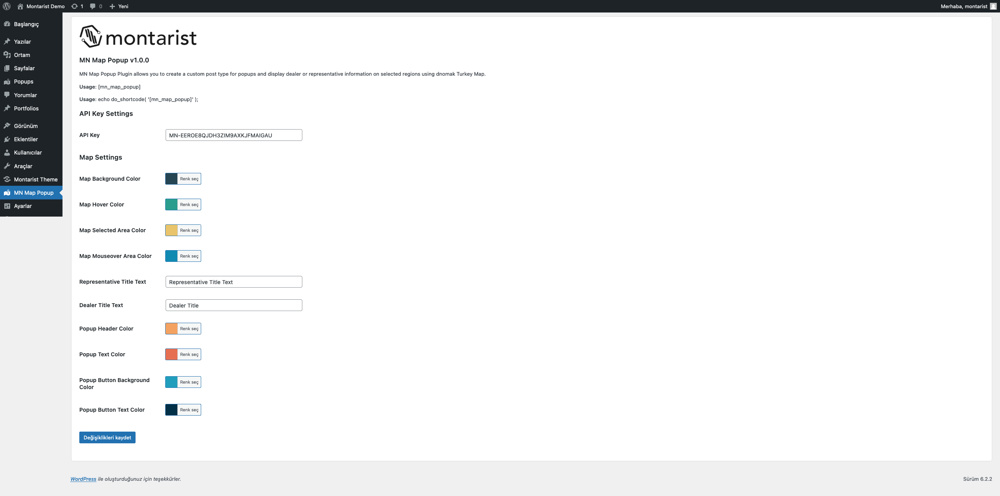
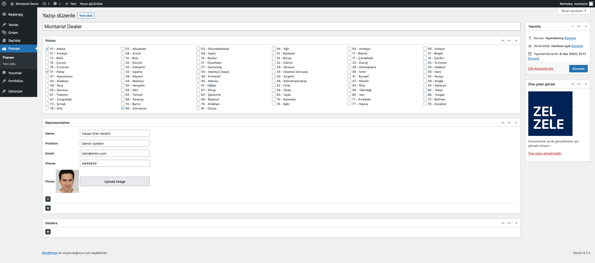
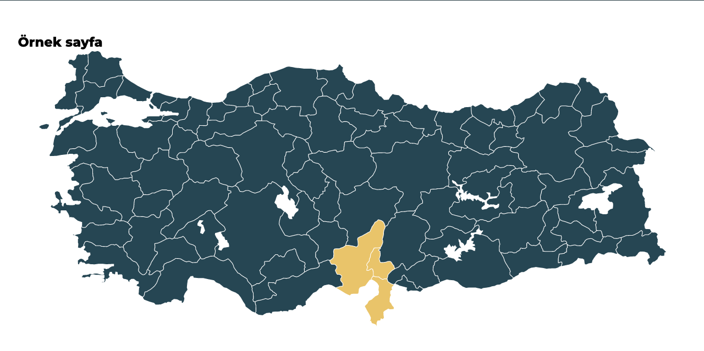
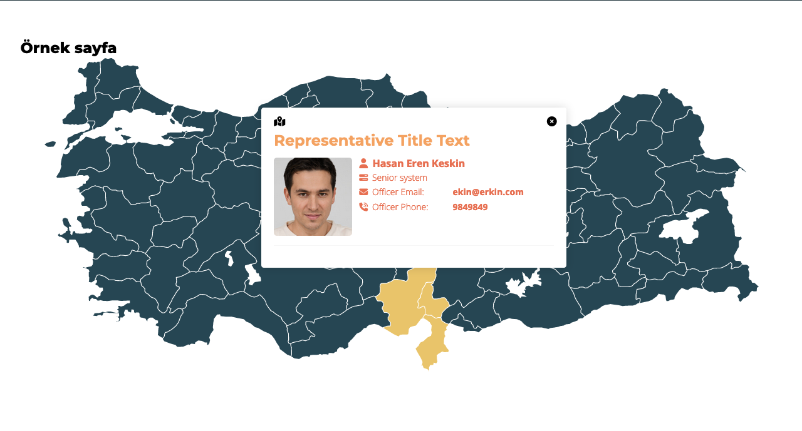

# MN Map Popup

  

**Contributors:** The Montarist Team  
**Tags:** map, popup, turkey, dealer information, representative information, regions  
**Requires at least:** 5.2  
**Tested up to:** 6.0  
**Stable tag:** 1.0.0  
**License:** GPL-2.0+  
**License URI:** http://www.gnu.org/licenses/gpl-2.0.txt

## Description

[MN Map Popup](https://wordpress.com/plugins/mn-map-popup) is a plugin that allows you to create a custom post type for popups and display dealer or representative information on selected regions using dnomak Turkey Map.

With this plugin, you can create unique popups for each region of Turkey and fill them with the information of your choosing.

## Screenshots

1. 
2. 
3. 
4. 

## Installation

1. Download the plugin files and upload them to your `/wp-content/plugins/` directory, or install the plugin through the WordPress plugins screen directly.
2. Activate the plugin through the 'Plugins' screen in WordPress
3. Use the Settings->MN Map Popup screen to configure the plugin

## Changelog

### 1.0.0

* Add Representative and Dealers to Turkey Map.
* Change all color settings on admin panel.
